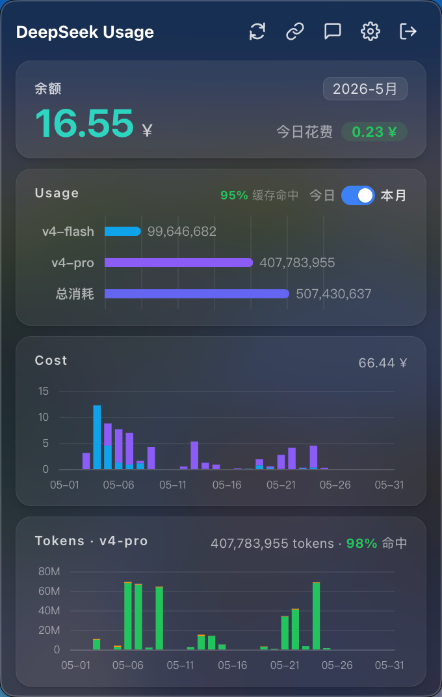
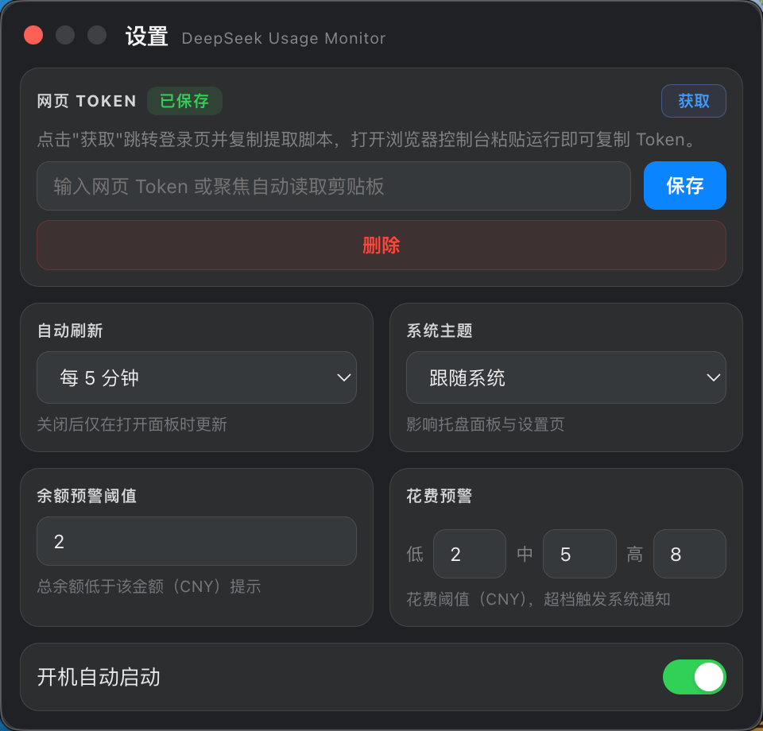

# DeepSeek Usage Monitor


macOS 菜单栏工具，用于监控 DeepSeek API 余额与用量。

## 截图

<p>
	
	
</p>

## 功能

- 余额与今日花费展示
- 用量与成本图表（支持按月切换）
- 今日 / 本月用量切换
- 缓存命中率展示
- 余额/当日花费阈值提醒
- 状态栏单击打开面板，双击直达 DeepSeek Chat
- 一键打开用量页面、Chat、设置
- 支持深色/浅色与系统主题联动
- 支持自动刷新

## 开发

```bash
pnpm install
pnpm electron:dev
```

## 构建

```bash
pnpm build
```

## 打包（macOS）

```bash
pnpm electron:build
```

产物输出到 `dist/`。
